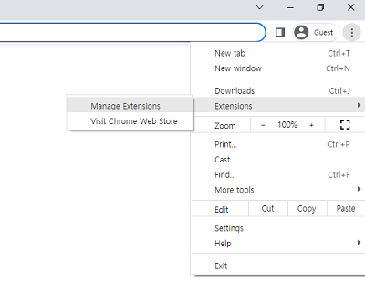
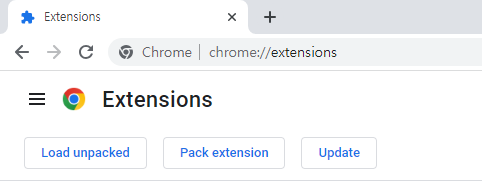
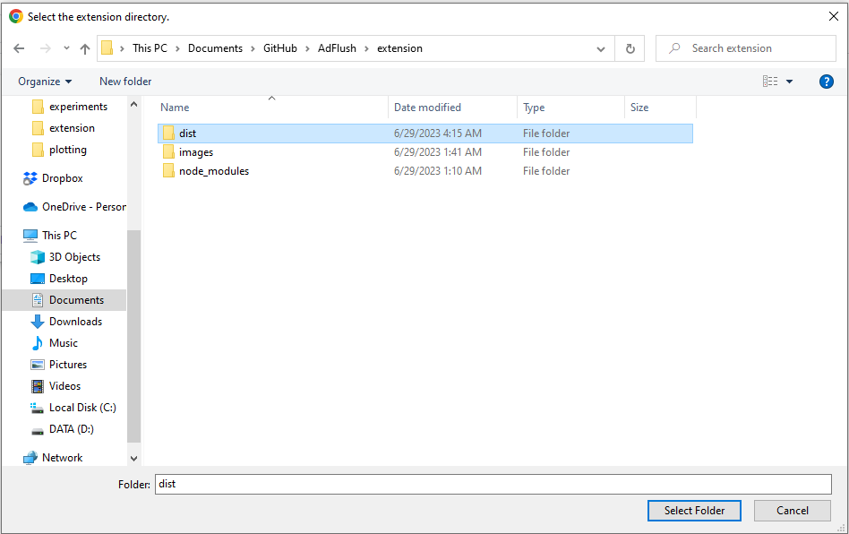
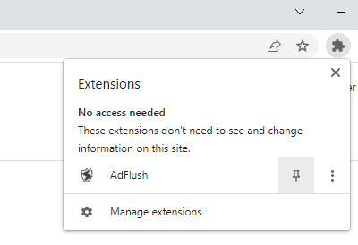
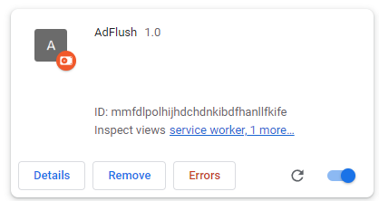

# Welcome to AdFlush

Document for submitted paper "AdFlush: A Lightweight and Accurate Web Tracking and Advertisement Detector" at NDSS 2024. 
*AdFlush* is the first advertisement and web tracker blocker Chrome Extension based on Machine Learning prediction. With thorough feature engineering process considering state-of-the-art methodology, *AdFlush* takes advantage of its lightweight and powerful classification ability to detect and block advertisement and web trackers preserving user privacy in the same time. Please refer to our paper for details of the framework and evaluation results of *AdFlush*.

The demo of exploring real-life web sites and detecting, blocking advertisements and trackers using *AdFlush* is available <a href="https://www.youtube.com/watch?v=PNvW-XfJMck">here</a>.
<hr>

## Within Python or Conda

### Prerequisites
This study has been run and tested in *Python==3.10.11*, *Conda==23.5.0*, and *Java==1.8.0_361.* 
#### Clone Repository
Setup the directory structure as it is the same as this GitHub repository.  
1. We recommend you to use <a href="https://github.com/fedebotu/clone-anonymous-github">Clone Anonymous Github</a> to clone this anonymous repository in ease.  

2. Move to the directory you want to import *AdFlush*.  
```bash
cd path/to/working/directory
```

3. Within the directory, run the following source codes.  
```bash
git clone https://github.com/fedebotu/clone-anonymous-github.git
python3 clone-anonymous-github/src/download.py --url https://anonymous.4open.science/r/AdFlush-93D1 --save_dir AdFlush
cd AdFlush/AdFlush-93D1
```

#### Python
To run the source codes in python environment run the following code.
```bash
pip install -r requirements.txt
```

#### Conda
To run the source codes in conda environment run the following code.
```bash
conda create --file environment.yml
conda activate adflush
```

#### H2O AutoML
In order to utilize our *AdFlush* mojo model, the system must have Java installed and running among versions 8, 9, 10, 11, 12, or 13. You can download Java as the same version as tested from <a href="https://www.oracle.com/kr/java/technologies/javase/javase8u211-later-archive-downloads.html">here</a>. 

#### Prepare Dataset
Download the files(*testset.csv*, *trainset.csv*) from https://zenodo.org/record/8091819 and replace the *\*.placeholder* files respectively in */dataset* folder. 

### How to evaluate *AdFlush*
Run the following source code within *AdFlush*'s directory to evaluate *AdFlush* within python based environment. We provide accuracy, precision, recall, F1-score, attack success rate (for GAN mutated dataset), false positive rate, false negative rate metrics for the given datasets. 
```bash
python3 source/main.py --dataset test
```
Output Example

> Loading test dataset...  
> Open ONNX session  
> Running...  
> Inference time elapsed:  0.24999642372131348 for  166032  samples.  
> Performace Metrics:  
>    Accuracy:  0.9788293822877517  
>    Precision:  0.9790394479726429  
>    Recall:  0.9676791453533113  
>    F1:  0.973326149479803  
>    ROC-AUC:  0.976957988057724  
>    False Negative Rate: 0.0323208546466887  
>    False Positive Rate: 0.01376316923786325  

- We must note that the results of the source code may differ from the results in our paper. The ONNX convertion involves compatibility within multiple environments, nessecary for browser extension implementation. However in this way the limit of Opsets in conversion acts as an upperbound in model performance by degrading precise floating point computation. 

Arguements

> - `--dataset` : the dataset to use in evaluation. Available values are `train`, `test`, and `gan`.  
> - `--model` : the model extract type to use in evaluation. Available values are `mojo` and `onnx`.  


### Generate GAN mutated datasets
Run the following source code within *AdFlush*'s directory to generate a new GAN mutated dataset. You can vary the parameters and also use the dataset to evaluate performance of *AdFlush*. 

<hr>

## Within Chrome Extension
The following browser extension is developed in `npm==9.5.1`.

### Setting Up *AdFlush*

1. Open a Chrome web browser.  

2. Click on the options and navigate to `Extensions` > `Manage Extensions`.  
    

3. Click on `Manage Extensions` Within the page, click on `Load unpacked`. If you don't see this button, make sure you have enabled `Developer mode` on the right side of the page.  
    

4. Navigate to `path/to/working/directory/AdFlush/extension/dist` and select the folder.  
    

5. Open your extensions and pin *AdFlush* to utilize full functionalities.  
    

### Applying Modification to *AdFlush*
If you decide to apply some modifications within our chrome extension or want to customize behavior, you must use <a href="https://webpack.js.org/">webpack</a> to repack the extension reflecting your modifications.

1. Open a command line prompt and navigate to `path/to/working/directory/AdFlush/extension`. Run the source code below to install the packages required for *AdFlush* chrome extension.
```bash
npm install
```

2. When you are done applying modifications to *AdFlush*, un the source code below to pack the source codes with appropriate npm packages. 
```bash
npx webpack --config webpack.config.js
```

3. Press the refresh button to reload *AdFlush* within your chrome extension and you are ready to run the modified *AdFlush*.  
    


## Training GAN
To train the GAN we implemented in robustness evaluation of *AdFlush*, we provide `generate_GAN.py` to train GAN upon desired hyperparameters. 

Modify the hyperparameters in `source/generate_GAN.py` and run the code below to train GAN and build a mutated dataset. 

```bash
python3 source/generate_GAN.py --feature adflush
```

Arguements

> - `--feature` : the feature set to fit and train GAN upon. Available values are `adflush`, `adgraph`, and `webgraph`. 

The output of the code above will generate a mutated dataset from the newly trained GAN as `GAN_custom_mutated_<featureset>.csv`. You can utilize this dataset to evaluate the robustness of *AdFlush*.

## Dataset
We opensource our *AdFlush* dataset used within our study. Our dataset consists of top 10K web pages from Tranco list, crawled at the date April 4, 2023. We divided our dataset for training processes and evaluation by 8:2 ratio. We also provide the dataset obtained with our trained GAN and used in robustness evaluation. These are available in `dataset` directory. 

Our dataset looks like as below. Note that the indices derive from splitting a full dataset into train/test thus are unique between both train and test.  
| (index) | visit_id     | name                                              | content_policy_type | url_length | is_subdomain | is_valid_qs | ... | label |
|---------|--------------|---------------------------------------------------|---------------------|------------|--------------|-------------|-----|-------|
| 0       | 1.700576e+11 | https://rbl.efnetrbl.org/                         | 0.036026            | 20         | 1            | 1           |     | 0     |
| 1       | 1.700576e+11 | https://rbl.efnetrbl.org/                         | 0.036026            | 25         | 1            | 1           | ... | 0     |
| 2       | 1.700576e+11 | https://www.google.com/recaptcha/api.js           | 0.474811            | 39         | 0            | 1           | ... | 0     |
| 3       | 1.700576e+11 | https://www.gstatic.com/recaptcha/releases/NZr... | 0.474811            | 84         | 0            | 1           | ... | 0     |
| 4       | 1.700576e+11 | https://www.gstatic.com/recaptcha/releases/NZr... | 0.474811            | 84         | 0            | 1           | ... | 0     |
| 5       | 1.700576e+11 | https://www.gstatic.com/recaptcha/releases/NZr... | 0.474811            | 84         | 0            | 1           | ... | 0     |
| 6       | 1.700576e+11 | https://www.gstatic.com/recaptcha/releases/NZr... | 0.474811            | 84         | 0            | 1           | ... | 0     |
| 8       | 1.700576e+11 | https://www.gstatic.com/recaptcha/api2/logo_48... | 0.384715            | 50         | 0            | 1           | ... | 0     |
| ...     | ...          | ...                                               | ...                 | ...        | ...          | ...         | ... | ...   |
| 830,159 | 9.004904e+15 | https://www.ziffdavis.com/s/zd/fonts/Helvetica... | 0.109323            | 64         | 1            | 1           | ... | 0     |  

Columns

> - `(index)` : Index of corresponding sample. Values are unique across both `trainset.csv` and `testset.csv`.  
> - `visit_id` : Visit ID obtained upon crawling via <a href="https://github.com/openwpm/OpenWPM">OpenWPM</a>.  
> - `<features used in WebGraph, AdGraph, WTAGraph>` : Aggregated columns of features used in the three studies are available in our dataset. The full list of features in order as in our dataset is available in `dataset/features.txt`.  
> - `req_url_[0-199]` : Character embeddings of request URL implemented in *AdFlush*. The values are obtainable by mapping each character in the URLs of request to our character dictionary `reqwordvec.json` trained upon our trainset, and then average the values.  
> - `fqdn_[0-29]` : Character embeddings of source URL implemented in *AdFlush*. The values are obtainable by mapping each character in the URLs of request to our character dictionary `fqdnwordvec.json` trained upon our trainset, and then average the values.  
> - `label` : Truth value of the corresponding sample. 1 indicates advertisement or web tracker sample, and 0 indicates as benign sample.  